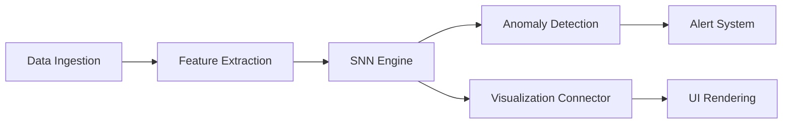

<div align="center">

# 🧠 KenshiBrainWatch

### Neural Network Cybersecurity Analysis Platform


<p align="center">
  
</p>

</div>

## 📋 Overview

**KenshiBrainWatch** is a cutting-edge cybersecurity platform that leverages neuromorphic computing principles to provide advanced threat detection, analysis, and visualization capabilities. The platform uses spiking neural networks (SNNs) and modern visualization techniques to transform traditional security monitoring into an immersive, intuitive experience.

> 🚀 **Mission**: To revolutionize cybersecurity monitoring through neural network visualization and real-time anomaly detection.

## ✨ Key Features

<table>
  <tr>
    <td width="50%">
      <h3 align="center">🔍 Neural Flow Visualization</h3>
      <p align="center">Interactive 3D visualization of neural network activity with real-time traffic patterns and anomaly highlighting.</p>
      <p align="center"></p>
    </td>
    <td width="50%">
      <h3 align="center">🧠 AI Brain Monitoring</h3>
      <p align="center">3D brain-inspired interface showing neural activity, with interactive controls for layer visibility.</p>
      <p align="center"></p>
    </td>
  </tr>
  <tr>
    <td width="50%">
      <h3 align="center">🛡️ Anomaly Detection Engine</h3>
      <p align="center">Spiking neural networks trained to identify unusual patterns in network traffic and system behavior.</p>
      <p align="center"></p>
    </td>
    <td width="50%">
      <h3 align="center">📊 Real-time Analytics Dashboard</h3>
      <p align="center">Cyberpunk-inspired interface with comprehensive metrics, alerts, and system health indicators.</p>
      <p align="center"></p>
    </td>
  </tr>
</table>

## 🧪 Core Components

### 🔄 Neuromorphic Processing Pipeline



- **Data Ingestion**: Collects and normalizes network traffic and system data
- **Feature Extraction**: Transforms raw data into meaningful neural inputs
- **SNN Engine**: Processes inputs through configurable spiking neural networks
- **Anomaly Detector**: Flags unusual patterns based on learned behavior
- **Alert System**: Generates notifications with contextual information
- **Visualization Connector**: Bridges neural activity to visual representations

## 🛠️ Technology Stack

<div align="center">

### Frontend


### 3D Visualization


### UI Components


</div>

## 🚀 Getting Started

### Prerequisites

- **Node.js** 18+ or **Bun** runtime
- **npm**, **yarn**, or **bun** package manager

### Installation

```bash
# Clone the repository
git clone https://github.com/yuv1kun/Kensh1i.git

# Navigate to project directory
cd Kensh1i

# Install dependencies
npm install
# or
yarn install
# or
bun install

# Start development server
npm run dev
# or
yarn dev
# or
bun dev
```

### Development Commands

| Command | Description |
|---------|-------------|
| `npm run dev` | Start development server |
| `npm run build` | Build for production |
| `npm run preview` | Preview production build |
| `npm run lint` | Run ESLint |
| `npm run type-check` | Check TypeScript types |

## 📱 User Interface

<div align="center">

</div>

The interface is designed with a cyberpunk aesthetic featuring:

- **Dark Mode Optimized**: High contrast visualization for security operations centers
- **Command Palette**: Quick access to all platform features via keyboard shortcuts
- **Adaptive Layouts**: Responsive design for desktop monitoring stations and NOCs
- **Interactive 3D Models**: Manipulable neural network visualizations

## 🔗 Architecture

KenshiBrainWatch uses a modular architecture with:

- **Component-based UI**: Independent, reusable interface components
- **Custom Hooks System**: Encapsulated business logic and state management
- **Neural Processing Library**: Dedicated neuromorphic computing modules
- **Visualization Engine**: Hardware-accelerated graphics rendering
- **Mock Data System**: Development environment with realistic traffic simulation

## 🤝 Contributing

We welcome contributions to KenshiBrainWatch! Please feel free to submit issues and pull requests.

## 📄 License

This project is licensed under the MIT License - see the LICENSE file for details.

---

<div align="center">

**KenshiBrainWatch** — Neural Network Cybersecurity Analysis Platform  
Made with ❤️ by Yuvraj Kumar

</div>
npm run lint
```

## 🎯 Usage Guide

### 🚦 **Getting Started**
1. **Launch the Platform** - Open the application in your browser
2. **Start Analysis** - Click the "Trigger Analysis" button in the AI Brain section
3. **Monitor Threats** - Watch real-time threat detection in action
4. **Explore Visualizations** - Navigate through different monitoring panels

### 🎮 **Key Controls**
- **`Ctrl + K`** - Open command palette
- **`Ctrl + Shift + A`** - Open AI assistant
- **Space** - Start/pause neural analysis
- **Toggle Switches** - Control layer visibility and effects

### 📈 **Understanding Metrics**
- **Anomaly Score** - Threat likelihood (0-100%)
- **Active Threats** - Current security incidents
- **Neural Efficiency** - AI processing performance
- **System Health** - Overall platform status

## 🏗️ Project Structure

```
src/
├── components/           # React components
│   ├── neural-flow/     # Neural network visualizations
│   ├── cyberpunk-visuals/ # Futuristic UI components
│   ├── analytics/       # Analytics and metrics
│   ├── command-interface/ # Command palette & AI
│   └── ui/              # Shadcn UI components
├── pages/               # Application pages
├── hooks/               # Custom React hooks
├── lib/                 # Utility functions
└── data/                # Sample data and generators
```

## 🎨 Key Components

### **Neural Flow Visualization**
Interactive neural network diagram with:
- Layer-based neuron organization
- Real-time connection visualization
- Traffic state indicators
- Particle flow effects

### **AI Brain Interface**
3D Spline brain model featuring:
- Real-time neural activity
- Interactive controls
- Anomaly detection display
- Analysis state management

### **Command Interface**
Powerful command system with:
- Searchable command palette
- AI-powered assistant
- Voice-like interactions
- Contextual suggestions

### **Cyberpunk Dashboard**
Futuristic monitoring interface:
- Neon-styled components
- Matrix-like effects
- Real-time data streams
- Holographic displays

## 🔧 Configuration

### **Environment Variables**
Create a `.env.local` file for custom configuration:

```env
# API Configuration
VITE_API_BASE_URL=https://api.example.com
VITE_NEURAL_API_KEY=your_api_key_here

# Feature Flags
VITE_ENABLE_3D_BRAIN=true
VITE_ENABLE_AI_ASSISTANT=true
VITE_DEBUG_MODE=false
```

### **Customization**
- **Theme**: Modify `tailwind.config.ts` for custom colors
- **Components**: Extend Shadcn components in `src/components/ui/`
- **Data**: Update sample data in `src/data/sampleNetworkData.ts`

## 🚀 Deployment

### **Using Lovable**
1. Click the **Publish** button in Lovable editor
2. Your app will be deployed to `yoursite.lovable.app`
3. Connect custom domain in Project Settings

### **Self-Hosting**
```bash
# Build the application
npm run build

# Deploy the 'dist' folder to your hosting provider
# Supports Vercel, Netlify, AWS S3, etc.
```

### **Docker Deployment**
```dockerfile
FROM node:18-alpine
WORKDIR /app
COPY package*.json ./
RUN npm ci --only=production
COPY . .
RUN npm run build
EXPOSE 3000
CMD ["npm", "run", "preview"]
```

## 🤝 Contributing

We welcome contributions! Here's how to get started:

1. **Fork** the repository
2. **Create** a feature branch: `git checkout -b feature-name`
3. **Commit** your changes: `git commit -m 'Add feature'`
4. **Push** to the branch: `git push origin feature-name`
5. **Submit** a pull request

### **Development Guidelines**
- Follow TypeScript best practices
- Use Tailwind CSS for styling
- Write meaningful commit messages
- Test your changes thoroughly
- Update documentation as needed

## 📝 License

This project is licensed under the MIT License - see the [LICENSE](LICENSE) file for details.

## 🙏 Acknowledgments

- **Lovable** - For the amazing development platform
- **Spline** - For 3D visualization capabilities
- **Shadcn** - For beautiful UI components
- **React Community** - For the incredible ecosystem

## 📞 Support

- 📧 **Email**: support@yourproject.com
- 💬 **Discord**: [Join our community](https://discord.gg/yourserver)
- 📖 **Docs**: [Full documentation](https://docs.yourproject.com)
- 🐛 **Issues**: [Report bugs](https://github.com/yourusername/yourrepo/issues)

---

<div align="center">

**Made with ❤️ and ⚡ by the Neural Security Team**

[⭐ Star this repo](https://github.com/yourusername/yourrepo) • [🚀 Try Demo](https://your-demo-url.lovable.app) • [📱 Follow Updates](https://twitter.com/yourhandle)

</div>
